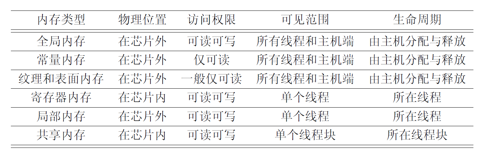
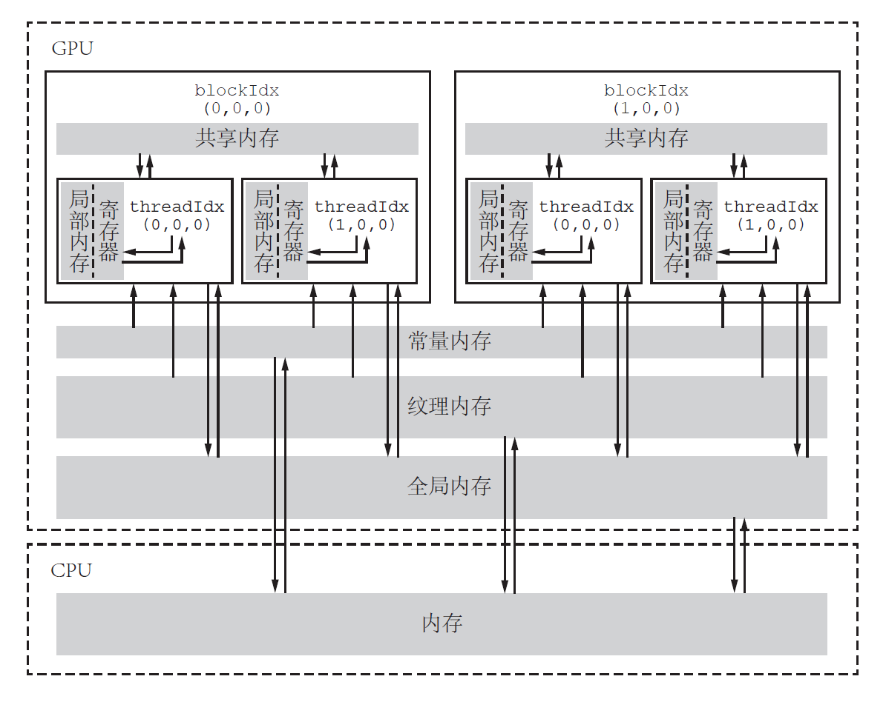
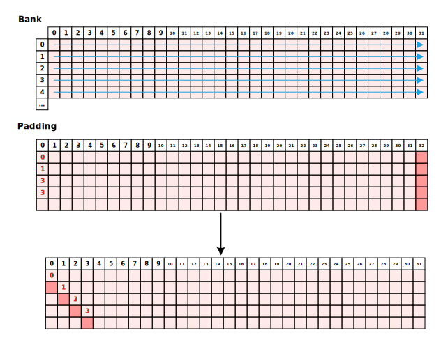

# CUDA-Learning
Using CUDA programming to implement some simple examples.
> The author conducts CUDA programming study based on some examples, aiming to understand some syntax operations as well as familiarize with introductory examples.
>
> Reference content:
>
> - [CUDA 编程模型系列](https://www.bilibili.com/video/BV1vP411v7g4/?spm_id_from=333.788&vd_source=f9a58fa9ec474778cd43832fb746c14a)
> - [CUDA-Programming-book draft](https://github.com/brucefan1983/CUDA-Programming/blob/master/src/book_draft.pdf)
>
> Table of Contents:
>
>  - [CUDA-Learning](#cuda-learning)
>  - [Mastery](#mastery)
>  - [Instance logging](#instance-logging)
>    - [`VecAdd.cu`](#vecaddcu)
>      - [memory type](#memory-type)
>      - [CHECK](#check)
>    - [`MM.cu`](#mmcu)
>      - [event time test](#event-time-test)
>    - [`conv.cu`](#convcu)
>    - [`MM_V2.cu`](#mm_v2cu)
>    - [`TransM.cu`](#transmcu)
>    - [`Reduce.cu`](#reducecu)
>    - [`topk.cu`](#topkcu)
>
> 2023-7-31--2023-8-9


## Mastery

- Building simple code frameworks

  > A coding framework is considered in terms of the following steps
  >
  > ```c++
  > int main(void){
  > //cpu & initialize
  > //gpu & initialize
  > //cpu to gpu
  > //calculate
  > //gpu to cpu
  > //test
  > //free
  > return 0; 
  > }
  > ```
  
- Some code details and tips

  > - Different types of memory in CUDA
  > - CHECK
  > - Event Timing

## Instance logging

### `VecAdd.cu`

This example implements the addition of two vectors, applying a one-dimensional `grid` and `block`. Here, the tutorial uses a `for` loop to test if the kernel function is correct. Given the parallel environment, the author considered why not just do the verification in parallel.

So it was adapted, but there were many errors, which are documented here, and the main function part is omitted below.

```c++

bool test_cpu = false;		//global variable
__global__ void check_gpu(const double* d_z, const double* gpu_result, const int N) {
	const int index = blockDim.x * blockIdx.x + threadIdx.x;
	if (index < N) {
		if (fabs(d_z[index] - gpu_result[index]) > 1.0e-15) {
			test_cpu = true;
		}
	}
}
```

> The error is as follows:
>
> ```powershell
> error: identifier "test_cpu" is undefined in device code
> ```

Follow the prompt to change to:

```c++
__device__ bool test_cpu = false;
```

> The error is as follows:
>
> ```powershell
> warning #20091-D: a __device__ variable "test_cpu" cannot be directly read in a host function
> ```

So the author thought of transferring the variable ``test_cpu`` to the host and then outputting it, that is, forcing the conversion with the existing knowledge:

```c++
bool* error_cpu = (bool*)malloc(sizeof(bool));
cudaMemcpy(error_cpu, *test_cpu, sizeof(bool), cudaMemcpyDeviceToHost);
```

> The error is reported as follows:
>
> ```powershell
> error: operand of "*" must be a pointer but has type "__nv_bool"
> ```

Eventually looked up the new function and how to use it, and learned the memory types, which are listed below.

#### memory type

> Post the content here, haven't applied it, not sure of the exact call scenario and the way, which is also mentioned in **TO DO**.





The specific functions are found in the `MemTest.cu` file

> Use `printf( ) ` as an example. When it is placed under the `__global__` modifier, it acts as a function of the device, and when it is placed in the main function it is a function of the host.

#### CHECK

> Defines the `error.cuh` header file for error message output, which is used to check for the memory allocation and transfer problems described above.


### `MM.cu`

> This example implements multiplication of matrices, which in the tutorial are set to be square matrices, and is implemented here using `M`, `K`, and `N` with three different `row` and `col`. But only the naive version was implemented, without optimization for access etc. This is the next step in the program.

When I reproduced this example, I made some mistakes by not aligning the `x y` axes with the `col` and `row` of the matrix, but after fixing it, I also successfully implemented matrix multiplication and gained a better understanding of the assignment of `grid` and `block`.

#### event time test

> Test the runtime of the CPU version and the GPU version.

Some function templates are

```c++
int main(void){
  //define
  cudaEvent_t start, stop_cpu, stop_gpu;
  cudaEventCreate(&start);
  cudaEventCreate(&stop_cpu);
  cudaEventCreate(&stop_gpu);    

  cudaEventRecord(start);
  //GPU Function;
  cudaEventRecord(stop_gpu);
  cudaEventSynchronize(stop_gpu);
  //CPU Function;
  cudaEventRecord(stop_cpu);
  cudaEventSynchronize(stop_cpu);    

  // time comparing
  float time_cpu, time_gpu;
  cudaEventElapsedTime(&time_gpu, start, stop_gpu);
  cudaEventElapsedTime(&time_cpu, start, stop_cpu);

  printf("GPU time is %.7f ms\n", time_gpu);
  printf("CPU time is %.7f ms\n", time_cpu);

  cudaEventDestroy(start);
  cudaEventDestroy(stop_cpu);
  cudaEventDestroy(stop_gpu);
}	
```

                                           

### `conv.cu`

> This example implements the `3*3` convolution operation and `Sobel` edge detection, using `opencv`. The author tried unsuccessfully for 2 hours on a win11 system and successfully gave up, using random numbers to construct the grayscale image matrix.

The details and the configuration of `grid` and `block` are similar and not listed here.


### `MM_V2.cu`

> Increase speed by chunking matrices and moving them to shared mem for multiplication.

In this implementation of matrix multiplication, a `BLOCK_SIZE` sized `sub` matrix is used to move the data. In this process, I wrote the wrong judgment condition of the loop and caused an error, which is recorded here.

When moving data, the variable `step` is used to split the original large matrix, and the loop condition of `step` is `step <= K / BLOCK_SIZE`. The condition `=` is not added because only the case of integer division is considered at first. And no out-of-bounds judgment was added, resulting in non-integer divisions not being written in the `sub` square.

**A few more details**.

- On Win system, add `cudaDeviceSynchronize();` after calling or executing the function of device to avoid the program can't output. Since this version uses ` __managed__`-modified variables, it does not use data-moving functions. The data moving function automatically calls `cudaDeviceSynchronize();`, so the previous version automatically adjusted it even if it didn't add this function.
- When timing events, two device function calls are timed using two sets of events.

The speed of the run has increased, and the result on one occasion was as follows

```powershell
Time_gpu1 is 1.73488 ms.
Time_gpu2 is 0.31091 ms.
Time_cpu is 171.48985 ms.
Result is pass.
```


### ``TransM.cu``

> Implement the matrix transpose operation, also use `shared mem` to speed up, but need to pay attention to avoid bank conflict problem. The author lists his understanding.

In shared memory, consecutive 32-bits words are allocated to 32 consecutive banks, which is like the seats in a movie theater: a column of seats is equivalent to a bank, so each row has 32 seats, and in each seat, you can "sit" a 32-bit data (or multiple data less than 32-bits, e.g., 4 data). bits of data, such as 4 char-type data, 2 short-type data); and under normal circumstances, we are in accordance with the order of the first line and then sit down a line to sit in the order of the seat, in the shared memory address mapping is the same way.

Multiple threads in a warp accessing the same bank will conflict, ignoring of course the multicast and broadcast mechanisms. Then as in the following figure, `bank[0][1]` and `bank[0][1]` are in conflict, and after the conflict, the parallelism will be converted to serialization, and the computational efficiency will be reduced dramatically.

Then using padding, you can add out of that column all shift, stagger the conflict data. As shown in the figure below.



The result is as follows. Shared memory is used to achieve the speedup effect.

```powershell
Time_gpu1 is 1.60374 ms.
Time_gpu2 is 0.71379 ms.
Time_cpu is 21.53981 ms.
Result is pass.
```

### `Reduce.cu`.

> Implemented a summing operation on an array, using shared memory as well as atomic operations, and learned the conditions for using atomic operations in that scenario. Documented understanding of the core steps.

- Add back the data beyond what the number of threads can handle to the corresponding location, with the data spaced by the number of all threads. The length of the data is now the full number of threads.
- Use shared memory to collect data the size of the number of threads in a block for processing. This is now equivalent to all the blocks processing a piece of data of length `blockDim.x` in parallel.
- In the end, since there is only one result, the first thread in each block uses an atomic summing operation to accumulate the results.

At first, I did not understand how to store the data of length `gridDim.x * blcokDim.x` with only `BLOCK_SIZE` size of shared memory. It finally occurred to me that the shared memory is distributed in each block, so it's equivalent to an array performing parallel operations.

### `topk.cu`

> Implemented to find the top k largest data. Record the understanding of the core steps as follows.

- In the main function section `2_pass` is used to compute the result in two steps.

- Again, as in the previous example of the statute, the number of threads in excess of the number of threads is calculated first, and arranged in order of size. The total number is now `gridDim.x * blcokDim.x`.

- Allocate shared memory, the size of the shared memory is `K * BLOCK_SIZE` which corresponds to processing K data per thread. To make it easier to understand the process, the author is testing it with a small amount of data.

   ```powershell
  topk[0] is 15.
  topk[0] is 16.
  topk[0] is 17.
  topk[0] is 18.
  topk[0] is 19.
  topk[0] is 20.
  The blockidx is 1. Threadidx is 0.
  The blockidx is 1. Threadidx is 1.
  The blockidx is 2. Threadidx is 0.
  The blockidx is 2. Threadidx is 1.
  The blockidx is 0. Threadidx is 0.
  The blockidx is 0. Threadidx is 1.
  topk[1] is 9.
  topk[1] is 10.
  topk[1] is 11.
  topk[1] is 12.
  topk[1] is 13.
  topk[1] is 14.
  The blockidx is 1. Threadidx is 0.
  The blockidx is 1. Threadidx is 1.
  The blockidx is 2. Threadidx is 0.
  The blockidx is 2. Threadidx is 1.
  The blockidx is 0. Threadidx is 0.
  The blockidx is 0. Threadidx is 1.
  topk[2] is 3.
  topk[2] is 4.
  topk[2] is 5.
  topk[2] is 6.
  topk[2] is 7.
  topk[2] is 8.
  The blockidx is 1. Threadidx is 0.
  The blockidx is 1. Threadidx is 1.
  The blockidx is 2. Threadidx is 0.
  The blockidx is 2. Threadidx is 1.
  The blockidx is 0. Threadidx is 0.
  The blockidx is 0. Threadidx is 1.
  ```

  You can see that each thread manages k data, which is equivalent to the above reductio ad absurdum operation a thread manages an array.

- Still using a `step` for the loop, the original thread corresponding to the array offset, from which the selected data and the original thread data sorting, to get the final result

- Once this has been done, you can derive the topk array under each block, using `2_pass` and setting `grid_size` to 1 on the second call to the function.

The final result:

```powershell
Result: Pass
CPU time: 56.72; GPU time: 0.83
```


  
