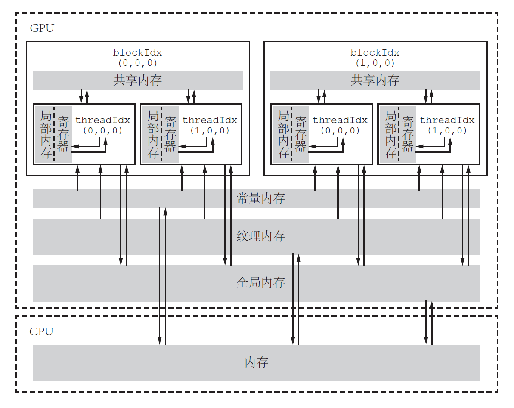

# CUDA学习

> 笔者根据一些实例进行CUDA编程学习，旨在了解一些语法操作以及熟悉入门实例。
>
> 参考内容：
>
> - [CUDA编程模型系列五](https://www.bilibili.com/video/BV1vP411v7g4/?spm_id_from=333.788&vd_source=f9a58fa9ec474778cd43832fb746c14a)
> - [CUDA-Programming-book draft](https://github.com/brucefan1983/CUDA-Programming/blob/master/src/book_draft.pdf)
>
> 目录
>
>  [CUDA学习](#cuda学习)
>  - [掌握的内容](#掌握的内容)
>  - [实例记录](#实例记录)
>    - [`VecAdd.cu`](#vecaddcu)
>      - [内存类型](#内存类型)
>      - [CHECK](#check)
>    - [`MM.cu`](#mmcu)
>      - [事件时间测试](#事件时间测试)
>    - [`conv.cu`](#convcu)
>  - [TO DO](#to-do)
>
> 2023-7-31——2023-8-2


## 掌握的内容

- 构建简单的代码框架

  > 代码框架从以下几个步骤考虑
  >
  > ```c++
  > int main(void){
  >     //cpu & initialize
  >     //gpu & initialize
  >     //cpu to gpu
  >     //calculate
  >     //gpu to cpu
  >     //test
  >     //free
  >     return 0;
  > }
  > ```

- 一些代码细节和技巧

  > - CUDA中不同类型的内存
  > - CHECK
  > - 事件计时

## 实例记录

### `VecAdd.cu`

本实例实现两个向量相加，应用了一维的 `grid` 和 `block`。在这里，教程中使用的是 `for` 循环测试核函数是否正确。鉴于在并行的环境下，笔者考虑为什么不直接并行地进行验证呢？

于是就进行了改造，但是出现了许多错误，在此记录，以下省略主函数部分。

```c++
/*Ver1*/
bool test_cpu = false;		//全局变量
__global__ void check_gpu(const double* d_z, const double* gpu_result, const int N) {
	const int index = blockDim.x * blockIdx.x + threadIdx.x;
	if (index < N) {
		if (fabs(d_z[index] - gpu_result[index]) > 1.0e-15) {
			test_cpu = true;
		}
	}
}
```

> 报错如下：
>
> ```powershell
> error: identifier "test_cpu" is undefined in device code
> ```

根据提示更改为：

```c++
__device__ bool test_cpu = false;
```

> 报错如下：
>
> ```powershell
> warning #20091-D: a __device__ variable "test_cpu" cannot be directly read in a host function
> ```

于是笔者想到将变量 `test_cpu` 转移到host上再输出，就是用现有的知识强行转换：

```c++
bool* error_cpu = (bool*)malloc(sizeof(bool));
cudaMemcpy(error_cpu, *test_cpu, sizeof(bool), cudaMemcpyDeviceToHost);
```

> 报错如下：
>
> ```powershell
> error: operand of "*" must be a pointer but has type "__nv_bool"
> ```

最终查到了新的函数以及使用方式，并且学习到了内存类型，如下列出。

#### 内存类型

> 将内容贴在这里，没有应用过，不清楚具体的调用情景以及方式，这也是 **TO DO** 里提到的。




具体的函数见 `MemTest.cu` 文件

> 以 `printf( ) `作为例子。当其放在`__global__`修饰的函数下，就作为device的函数，而放入main函数中就是host的函数。

#### CHECK

> 定义了 `error.cuh` 的头文件进行错误信息的输出，这个头文件用于检查上述的内存分配和转移问题。


### `MM.cu`

> 本实例实现矩阵的乘法，教程中的矩阵设定为方阵，这里使用 `M`，`K`，`N`三种不同的 `row` 和 `col` 进行实现。但是只实现了naive 的版本，没有对访存等进行优化。这是下一步计划。

笔者在进行这个实例的复现时，由于没有将`x y`轴与矩阵的 `col` 与 `row` 统一起来，导致出现了一些错误，进行修正后也顺利实现了矩阵乘法以及对 `grid` 和 `block` 的分配有了进一步的理解。

#### 事件时间测试

> 分别测试CPU版本和GPU版本的运行时间

一些函数模板如下

```c++
int main(void){
    //定义
	cudaEvent_t start, stop_cpu, stop_gpu;
	cudaEventCreate(&start);
	cudaEventCreate(&stop_cpu);
	cudaEventCreate(&stop_gpu);    
    
    cudaEventRecord(start);
    //GPU Function;
    cudaEventRecord(stop_gpu);
	cudaEventSynchronize(stop_gpu);
    //CPU Function;
	cudaEventRecord(stop_cpu);
	cudaEventSynchronize(stop_cpu);    
    
    // time comparing
	float time_cpu, time_gpu;
	cudaEventElapsedTime(&time_gpu, start, stop_gpu);
	cudaEventElapsedTime(&time_cpu, start, stop_cpu);

	printf("GPU time is %.7f ms\n", time_gpu);
	printf("CPU time is %.7f ms\n", time_cpu);

	cudaEventDestroy(start);
	cudaEventDestroy(stop_cpu);
	cudaEventDestroy(stop_gpu);
}	
```

​                                           

### `conv.cu`

> 该实例实现了 `3*3` 卷积操作以及 `Sobel` 边缘检测，要用到`opencv`。笔者在win11系统上尝试了2小时未成功，放弃，使用随机数模拟构造灰度图像矩阵。

具体细节以及grid和block的配置类似，不在这里列出。

## TO DO

- 优化矩阵乘法
- 矩阵转置
- 原子操作/归约
- ......
